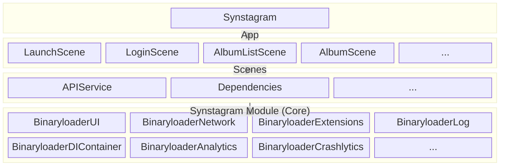

# synstagram-app

The Photo viewer project based on Synology's photo API and Instagram UI.  
All APIs, images and trademarks used in this project are reserved by [Synology Inc](https://www.synology.com/), [Instagram](https://www.instagram.com/) and [Icon8](https://icons8.kr/).

## Information

- [Synology's photo API (An Unofficial Reference)](https://blog.jbowen.dev/synology/photostation/)

## Application Structure
Synstagram adopted Modular Architecture.  
Modules are managed as separate targets and repositories.

### App
User client developed using all modules.

### Scenes
Smallest screen unit that makes up the app and adopts CleanSwift's VIP architecture pattern.

### SynstagramModule
Modules created using the BinaryloaderModule are essential modules for developing scenes or app.

### BinaryloaderModule
Modules such as network, log, and extensions needed to develop iOS apps as well as the synstagram.

## Repositories

### App
- https://github.com/binaryloader/synstagram-app

### Scenes
- https://github.com/binaryloader/synstagram-scene-login

### SynstagramModule
- https://github.com/binaryloader/synstagram-module-apiservice
- https://github.com/binaryloader/synstagram-module-dependencies

### BinaryloaderModule
- BinaryloaderUI
- BinaryloaderNetwork
- BinaryloaderDIContainer
- BinaryloaderExtensions

### CocoaPods Specs
- https://github.com/binaryloader/synstagram-scene-cocoapods-specs
- https://github.com/binaryloader/synstagram-module-cocoapods-specs
- https://github.com/binaryloader/cocoapods-specs

## Screenshots

### LaunchScene

### LoginScene

