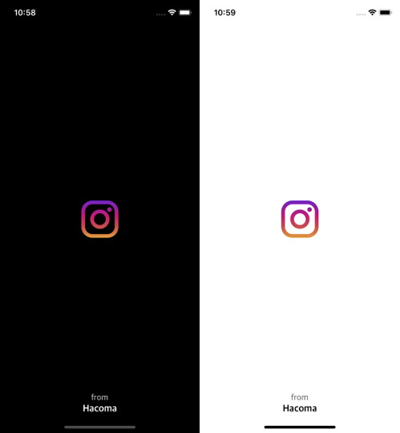
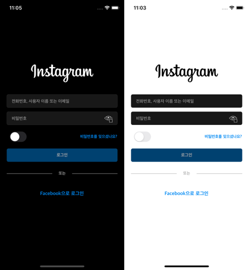
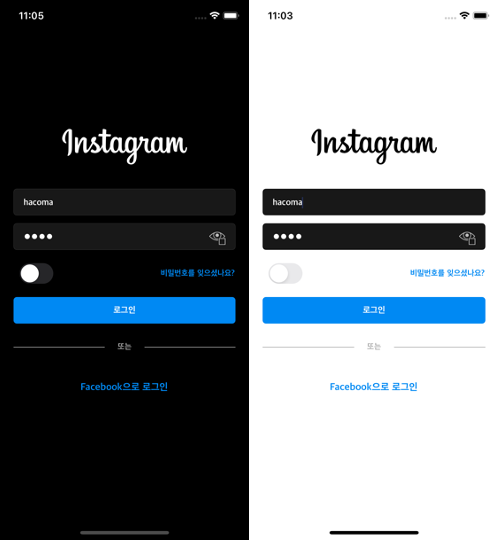

[English](../../../README.md) | [한국어](../ko/README.md) | **日本語**

# synstagram-app

SynologyのフォトAPIとInstagram風UIをベースにしたフォトビューアプロジェクトです。
本プロジェクトで使用しているすべてのAPI、画像、商標の権利は[Synology Inc](https://www.synology.com/)、[Instagram](https://www.instagram.com/)、[Icon8](https://icons8.kr/)に帰属します。

## 情報

- [SynologyのフォトAPI(非公式リファレンス)](https://blog.jbowen.dev/synology/photostation/)

## アプリケーション構成

Synstagramはモジュラーアーキテクチャを採用しています。
各モジュールは独立したターゲットおよびリポジトリとして管理しています。

### App

すべてのモジュールを利用して開発したユーザークライアントです。

### Scenes

アプリを構成する最小の画面単位で、CleanSwiftのVIPアーキテクチャパターンに従います。

### SynstagramModule

BinaryLoaderModuleを用いて作成したモジュールで、SceneやAppを開発するうえで欠かせない構成要素です。

### BinaryLoaderModule

ネットワーク、ログ、エクステンションなど、SynstagramだけでなくiOSアプリ開発全般に必要となるモジュールです。

## リポジトリ

### App

- https://github.com/binaryloader/synstagram-app

### Scenes

- https://github.com/binaryloader/synstagram-scene-login

### SynstagramModule

- https://github.com/binaryloader/synstagram-module-apiservice
- https://github.com/binaryloader/synstagram-module-dependencies

### BinaryLoaderModule

- https://github.com/binaryloader/binaryloader-ui
- https://github.com/binaryloader/binaryloader-network
- https://github.com/binaryloader/binaryloader-dicontainer
- https://github.com/binaryloader/binaryloader-extensions

### CocoaPods Specs

- https://github.com/binaryloader/synstagram-scene-cocoapods-specs
- https://github.com/binaryloader/synstagram-module-cocoapods-specs
- https://github.com/binaryloader/cocoapods-specs

## スクリーンショット

### LaunchScene

### LoginScene

## ライセンス

本プロジェクトはMITライセンスで配布しています。詳細は[LICENSE](../../../LICENSE)ファイルを参照してください。
